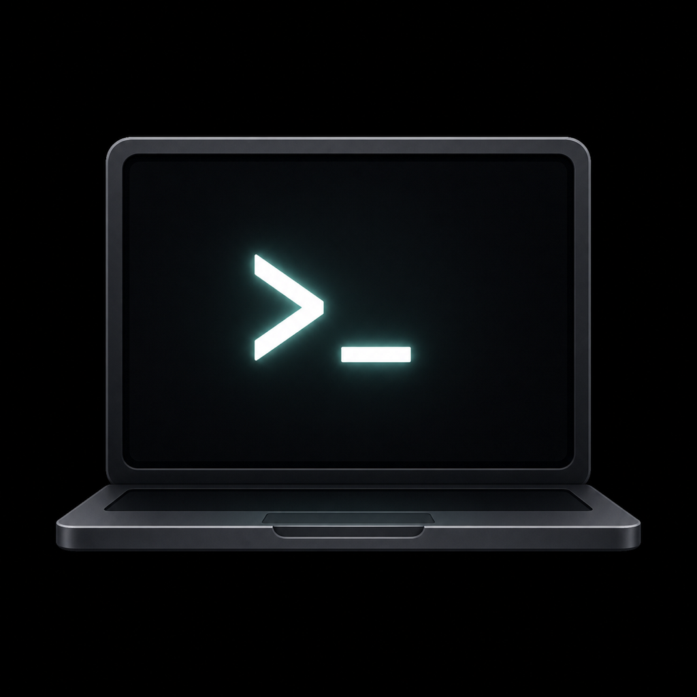
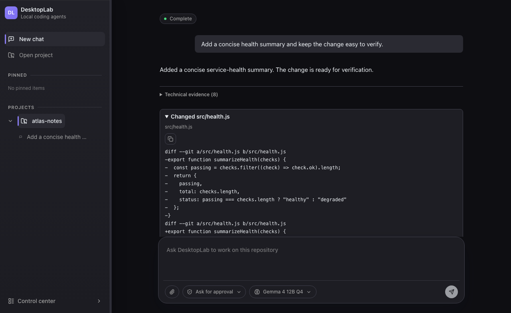
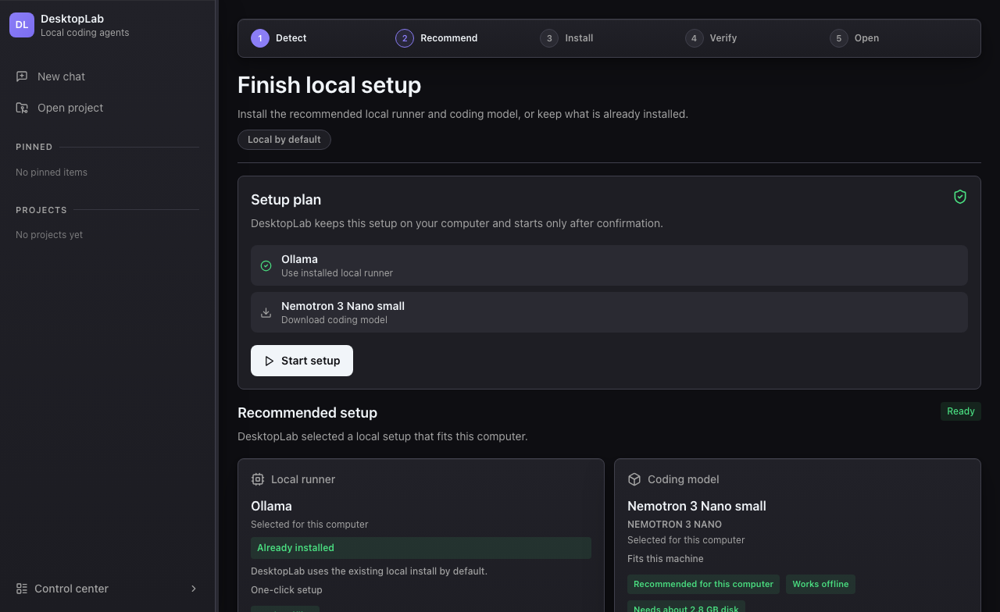
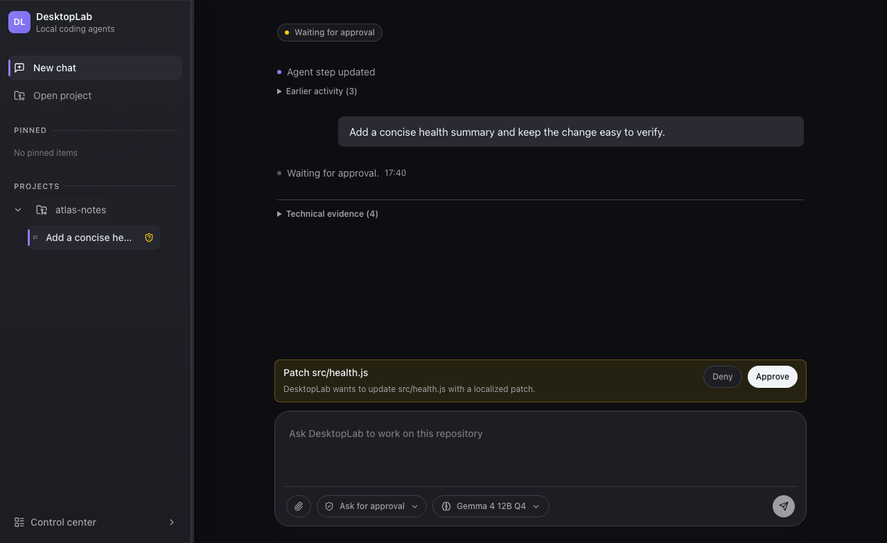
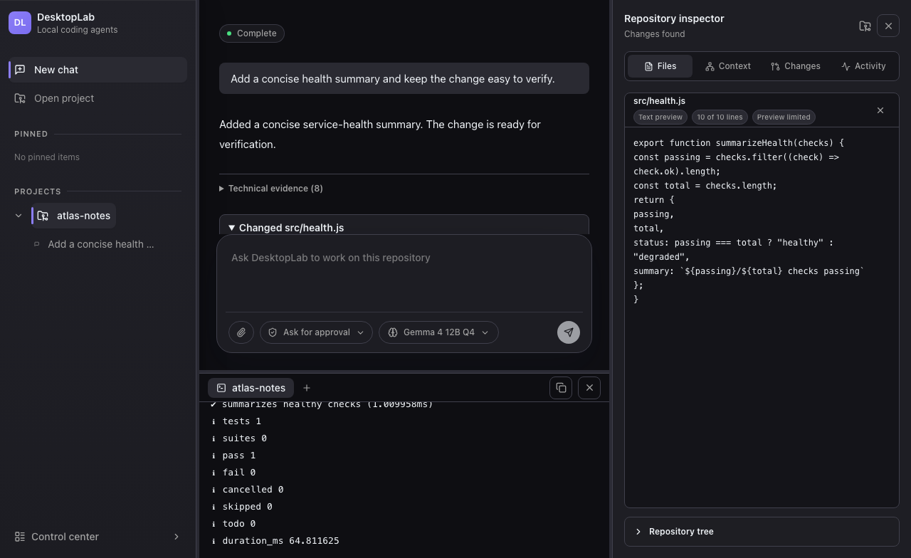

  

<h1 align="center">DesktopLab</h1>

  <strong>The local-first control plane for development agents.</strong>

  Open a repository, delegate real work and keep approvals, tools, terminal
  output, diffs and evidence in one persistent desktop workspace.

  
  
  
  

  <a href="https://github.com/Vitalisimon/desktoplab/releases/tag/v0.1.0-beta.10"><strong>Download the public beta</strong></a>
  ·
  <a href="docs-public/install.md">Installation</a>
  ·
  <a href="docs-public/runtime-and-provider-support.md">Runtime support</a>
  ·
  <a href="docs-public/support.md">Support</a>

DesktopLab is more than a chat window around a model. It owns the development
session and coordinates repositories, execution backends, local and optional
cloud runtimes, tools, approvals and durable evidence. The agent performs the
work; DesktopLab keeps the work understandable and governed.

## Start with a setup that fits your machine

DesktopLab detects local hardware and existing runtimes, then recommends a
compatible runner and coding model. The setup plan stays visible, starts only
after confirmation and clearly separates what is already installed from what
needs to be downloaded.

## Work locally without losing control

<table>
  <tr>
    <td width="50%">
      
    </td>
    <td width="50%">
      
    </td>
  </tr>
  <tr>
    <td valign="top">
      <strong>Approve consequential actions</strong> 
      Keep mutations visible and choose the approval mode that matches the task.
    </td>
    <td valign="top">
      <strong>Inspect the result in context</strong> 
      Review files, evidence and terminal verification without leaving the session.
    </td>
  </tr>
</table>

These are source-backed captures of the real interface, using a synthetic
local workspace with no personal data. See the
<a href="assets/readme/PROVENANCE.md">screenshot provenance</a>.

## Why DesktopLab

- **Local-first by design.** Repositories, sessions and local execution stay on
  your machine; cloud bridges are optional and policy gated.
- **The session belongs to you.** Execution backends do work and return events,
  but DesktopLab remains the persistent owner of context and evidence.
- **Provider and runtime agnostic.** Local runtimes, cloud providers and
  external agent backends fit behind declared capabilities and trust levels.
- **Evidence over hidden automation.** Approvals, tool activity, diffs,
  validation and failures remain inspectable.
- **Open-source core.** The Apache-2.0 core is intended to remain genuinely
  useful for individual developers and small teams.

## Get started

1. Download
   [DesktopLab v0.1.0-beta.10](https://github.com/Vitalisimon/desktoplab/releases/tag/v0.1.0-beta.10).
2. Follow the platform-specific
   [installation and verification guide](docs-public/install.md).
3. Open a repository and let the setup flow verify your local environment.
4. Choose an execution route, review the approval mode and send the first task.

DesktopLab does not bundle large runtime installers or model weights. Compatible
runtimes and models are selected through the setup flow based on host
capabilities. See [runtime and provider support](docs-public/runtime-and-provider-support.md)
for the currently verified boundary. In the published beta.10, Ollama is the
only certified automatic local-runtime route; LM Studio and MLX-LM work in
current source remains Preview until exact installed-app certification passes.

## Public beta availability

| Platform | Availability | Integrity |
| --- | --- | --- |
| macOS Apple Silicon | DMG available | Developer ID signed, notarized and stapled |
| Linux x64 | AppImage, deb and rpm available | SHA-256 and Sigstore bundles; rpm also has an OpenPGP package signature |
| Windows x64 | Not yet public | Blocked until trusted signing and exact-artifact verification are available |

Download only from the
[official GitHub Release](https://github.com/Vitalisimon/desktoplab/releases/tag/v0.1.0-beta.10),
verify `SHA256SUMS.txt` and never bypass Gatekeeper or package-signature checks.
Read the [release notes](docs-public/release-notes.md) and
[platform support matrix](docs-public/platform-support.md) before installing.

## Trust is part of the product

The public beta is bound to an exact public tag and ships with checksums, an
SBOM, provenance and updater-disabled evidence. Public source is produced from
the private development repository through a historyless, content-scanned
export gate; the private repository and its history are never published
directly.

- [Supply-chain and public export policy](docs-public/public-export-gate.md)
- [Security policy](docs-public/security.md)
- [Linux code-signing policy](docs-public/linux-code-signing-policy.md)
- [Windows code-signing policy](docs-public/windows-code-signing-policy.md)

No Windows artifact is public or represented as SignPath-signed.

## Project direction

DesktopLab is being built as a persistent local control plane for development
agents: offline-first where possible, cloud optional, repository focused and
modular enough for local, hybrid and future remote execution backends. The
open-source core is the product; future enterprise capabilities should add
governance, compliance and fleet scale without weakening that core.

## Maintainer

Created and maintained by [Simone Vitali](https://github.com/Vitalisimon).
DesktopLab began as an attempt to make long-running AI development work
inspectable, persistent and portable across local and optional cloud execution
backends.

## Community and updates

- [Reddit](https://www.reddit.com/user/DesktopLabHQ/) for technical discussions.
- [X](https://x.com/DesktopLabHQ) for short project updates.
- [YouTube](https://www.youtube.com/@DesktopLabHQ) for product videos.
- [Instagram](https://www.instagram.com/desktoplabhq/) for visual updates.
- [Facebook](https://www.facebook.com/profile.php?id=61592298009794) for community posts.

## Contributing and support

DesktopLab is in public beta. Reproducible reports from real macOS and Linux
installations are especially valuable.

- Read [support and issue-reporting guidance](docs-public/support.md).
- Report vulnerabilities through the [security policy](docs-public/security.md),
  not a public issue.
- Review the [Apache-2.0 license](LICENSE).
